# おいもサーバーBotの使い方 
(2021/05/27更新)

# 招待方法
おいもサーバー以外に招待する方は個人的にリンクを配布しますのでDMで申してください。

# 機能一覧
コマンドはすべて半角で入力する。

## アラーム機能(Voice:[まゆり](https://twitter.com/maLily_Vtu))

### 使い方(10時00にセット)
```
!alaram 10:00
```
コマンドを実行したらその時間にBotが通話部屋に入りアラームを鳴らしてくれる。<br>
※爆音のためbotの音量調節推奨<br>
※セットした人が通話部屋に入っていない場合Botは来てくれない。


### 例

1. アラームセット<br>
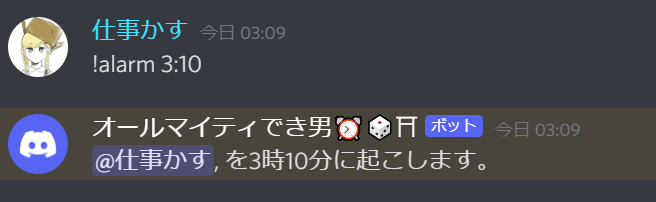<br>
2. 時間で知らせに来てくれて終わったら帰る<br>
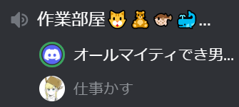<br>
3. 途中で帰らせたい場合は切断を選択<br>
<br>

## サイコロ機能
### 使い方(6面サイコロを1回振る)
```
!dice 1d6
```

### 例
1. 6面ダイスを6個振る<br>
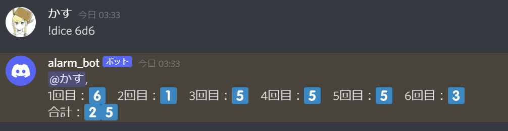<br>


## おみくじ機能
### おみくじを引く
```
!omikuji
```
## おみくじの排出率

- 大吉...16.0%
- 中吉...16.0%
- 小吉...16.0%
- 吉　...16.0%
- 凶　...16.0%
- 大凶...16.0%
- ????...4.00%

## おみくじ illustrator
- [いぬいぬのふわ](https://twitter.com/inuinu_0)
- [ゲラみ](https://twitter.com/nogugera)
- [おいも](https://twitter.com/oimosan1125)


## 例
1. おみくじを引く<br>
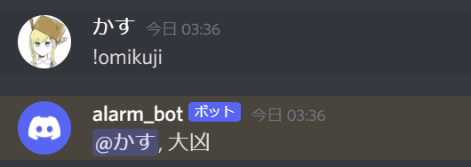<br>


## おみくじを使った人の反応
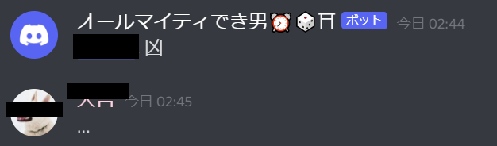
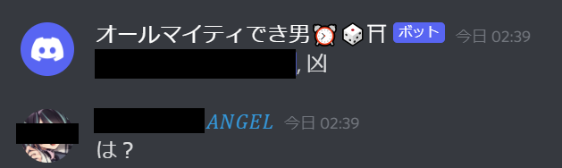
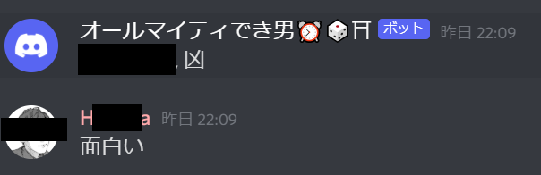
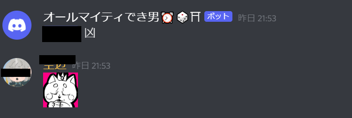
<br>【危険人物】<br>
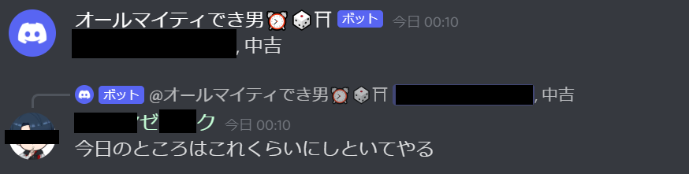
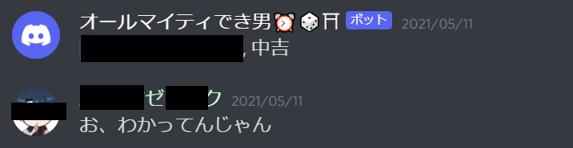
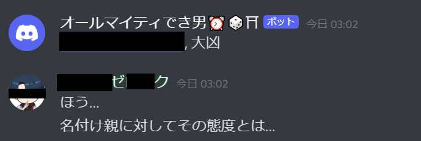
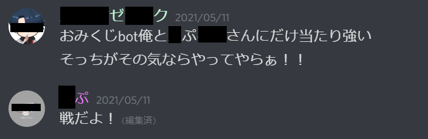
<br>
おみくじへの暴言はやめてください!!!親が泣いています...
<br>

# その他

## 追加実装予

- 時報
- 計算
- リマインダー
- アラーム音の充実
- ~~おみくじVersion UP!~~
- おみくじの回数制限(1日3回くらい？)

## 追加機能募集
これから勉強ついでに機能がゆっくり増えていくかもしれない...仕事が忙しくならなければ...

↓ほしい機能があれば<br>
[お題箱](https://odaibako.net/u/kkumt93)


