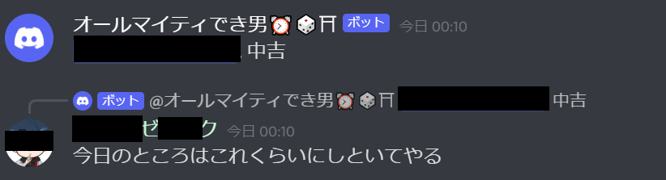

# おいもサーバーBotの使い方

# 招待方法
おいもサーバー以外に招待する方は個人的にリンクを配布しますのでDMで申してください。

# 機能一覧
コマンドはすべて半角で入力する。

## アラーム機能

### アラームをセットする(10時00にセット)
```
!alaram 10:00
```
コマンドを実行したらその時間にBotが通話部屋に入りアラームを鳴らしてくれる。<br>
※セットした人が通話部屋に入っていない場合Botは来てくれない。

### 例

1.アラームセット<br>
<br>
2.時間で知らせに来てくれる<br>
<br>
3.セットした人が何か発言すると帰る<br>
<br>

## サイコロ機能
### 6面サイコロを1回振る
```
!dice 1d6
```

### 例
1.6面ダイスを6個振る<br>
<br>


## おみくじ機能
```
!omikuji
```
## 例
1.おみくじを引く<br>
<br>

## おみくじを使った人の反応


<br>危険人物<br>





<br>
おみくじへの暴言はやめてください!!!親が泣いています...
<br>

# その他

## 追加実装予

- 時報
- 計算
- リマインダー
- アラーム音の充実
- おみくじVersion UP!

## 追加機能募集
これから勉強ついでに機能がゆっくり増えていくかもしれない...仕事が忙しくならなければ...

[お題箱](https://odaibako.net/u/kkumt93)


